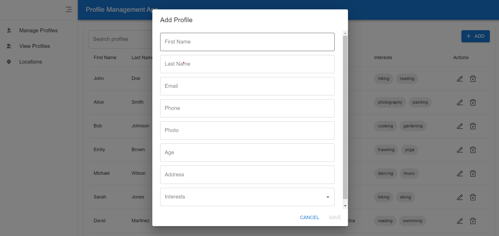

# Profile Management Application

This is a POC project to demonstrate profile management use case with React. The application currently has only frontend code and needs integration with backend to make it fully functional. Mock data is used to simulate the existing users. 

## Tech Stack

1. React
2. Typescript
3. Vite
4. Material UI
5. Tailwind CSS
6. React leaflet (as it was free alternative to Google Maps API)

## Features

1. Admins can add or edit existing user profiles
2. Page to view all profiles cards with summary
3. Page to view each profile
4. Locations page to view locations of all users
5. View location of individual user

## Running the Application

1. Clone this repository using `https://github.com/shreyap35/react-profile-management.git`
2. Install all the dependencies using `npm install`
3. `npm run dev`

## Screenshots

